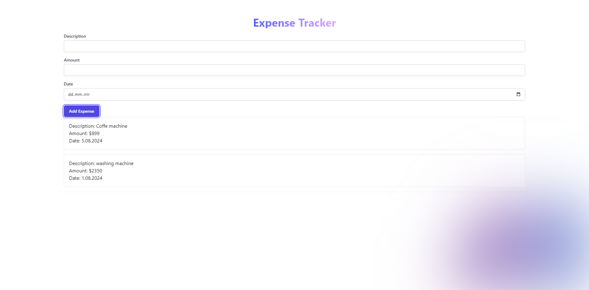
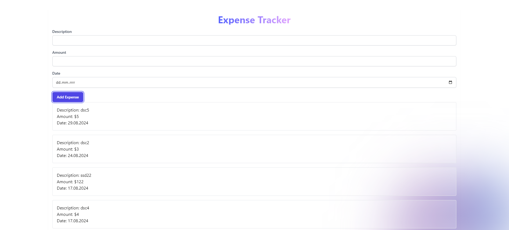
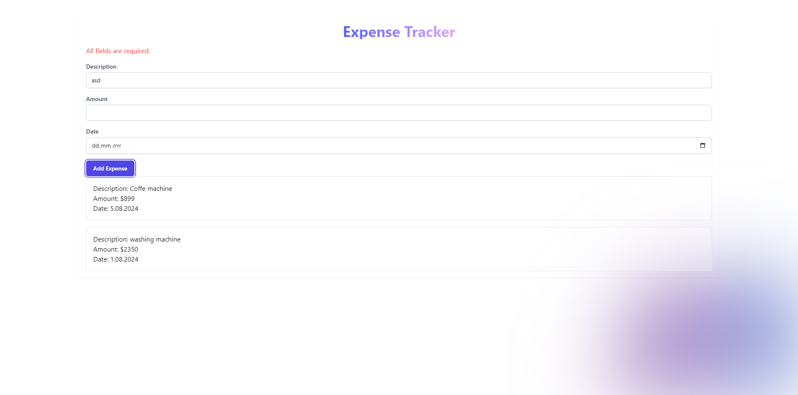
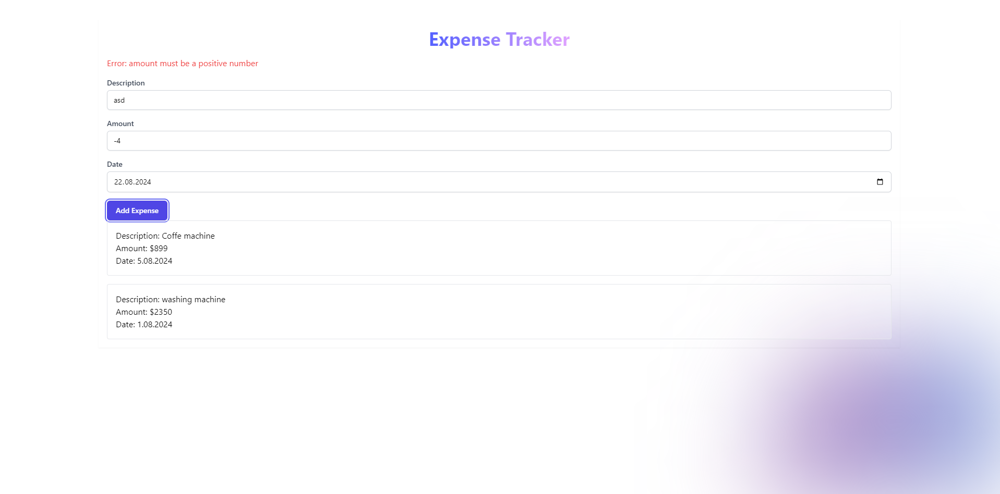
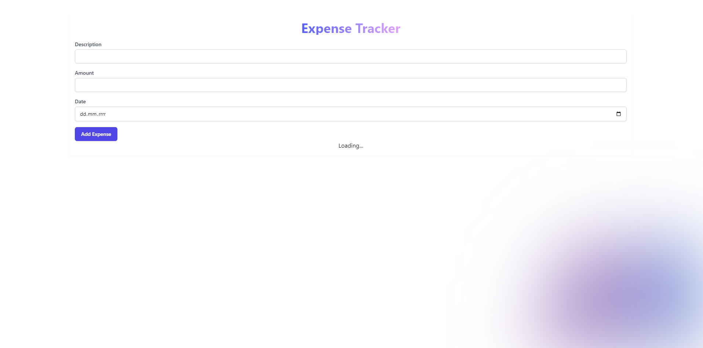
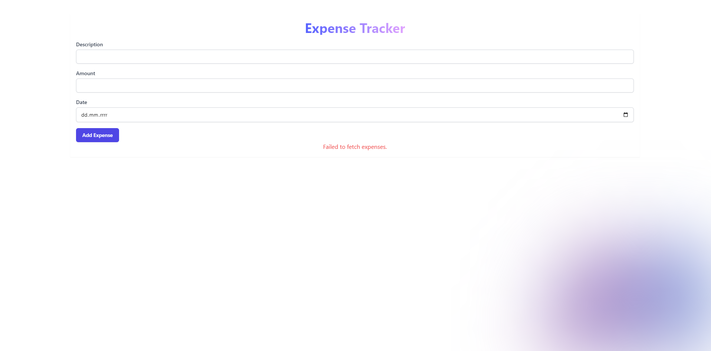

# Expenses Tracker

Expenses Tracker to aplikacja umożliwiająca zarządzanie wydatkami. Aplikacja składa się z frontendowej i backendowej części. Frontend napisany jest w React z TypeScript, a backend w NestJS z TypeScript. Projekt korzysta z bazy danych PostgreSQL do przechowywania danych o wydatkach.

## Spis Treści

1. [Opis Projektu](#opis-projektu)
2. [Backend](#backend)
3. [Frontend](#frontend)
4. [Uruchamianie Projektu](#uruchamianie-projektu)
5. [Zrzuty Ekranu](#zrzuty-ekranu)
6. [Technologie](#technologie)
7. [Biblioteki](#biblioteki)
8. [Autorzy](#autorzy)

## Opis Projektu

Aplikacja umożliwia dodawanie, wyświetlanie i sortowanie wydatków. Frontend komunikuje się z backendem poprzez REST API. Backend zarządza danymi, przechowując je w bazie danych PostgreSQL.

## Backend

### Instalacja

1.  **Sklonuj repozytorium:**

    ```bash

    git clone https://github.com/yourusername/expense-tracker.git

    ```

2.  **Przejdź do katalogu backendu:**

    ```bash

    cd backend

    ```

3.  **Zainstaluj zależności:**

    Upewnij się, że masz zainstalowane Node.js i npm. Następnie zainstaluj zależności:

    ```bash
    npm install
    ```

4.  **Konfiguracja Bazy Danych**

    Upewnij się, że masz zainstalowany PostgreSQL. Utwórz bazę danych o nazwie `expenses_db` oraz użytkownika z odpowiednimi uprawnieniami.

5.  **Uruchamianie Backend**

    Aby uruchomić aplikację backendową, użyj:

    ```bash
    npm run start

    ```

    Aplikacja będzie działać na porcie `3001`.

### Frontend

1. **Przejdź do katalogu frontendu:**

   ```bash

   cd frontend

   ```

2. **Instalacja Zależności**

   Upewnij się, że masz zainstalowane Node.js i npm. Następnie zainstaluj zależności:

   ```bash
   npm install
   ```

3. **Uruchamianie Frontend**

   Aby uruchomić aplikację frontendową, użyj:

   ```bash
   npm start
   ```

   Aplikacja będzie dostępna pod adresem `http://localhost:3000`.

### Endpointy API

- **GET /expenses** - Pobierz listę wydatków z opcjonalnym sortowaniem i limitowaniem.
- **GET /expenses/:id** - Pobierz szczegóły wydatku po ID.
- **POST /expenses** - Dodaj nowy wydatek.

## Uruchamianie Projektu

1. Uruchom backend zgodnie z powyższymi instrukcjami.
2. Uruchom frontend zgodnie z powyższymi instrukcjami.

## Zrzuty Ekranu














## Technologie

- **React**: Biblioteka do budowania interfejsów użytkownika.
- **Tailwind CSS**: Framework CSS do szybkiego stylizowania aplikacji.
- **Axios**: Klient HTTP do komunikacji z API.
- **TypeScript**: Statycznie typowany język JavaScript do poprawy jakości kodu.
- **NestJS**: Framework do budowy aplikacji backendowych w Node.js.
- **TypeORM**: ORM (Object-Relational Mapper) do integracji z bazą danych PostgreSQL.
- **PostgreSQL**: Relacyjna baza danych używana do przechowywania danych aplikacji.
- **Node.js**: Środowisko uruchomieniowe do obsługi backendu.

## Biblioteki

- **Frontend**: React, TypeScript, Tailwind CSS
- **Backend**: NestJS, TypeORM, PostgreSQL

## Autorzy

- Mikołaj Zwoliński

## Licencja

Ten projekt jest licencjonowany na warunkach licencji MIT.
